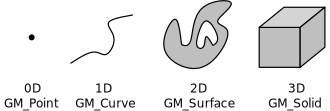
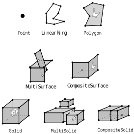
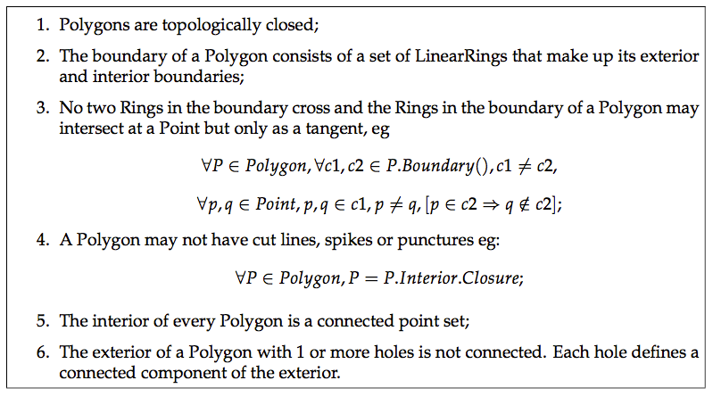
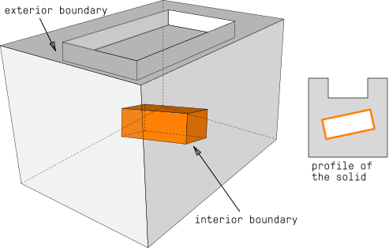
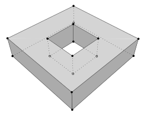
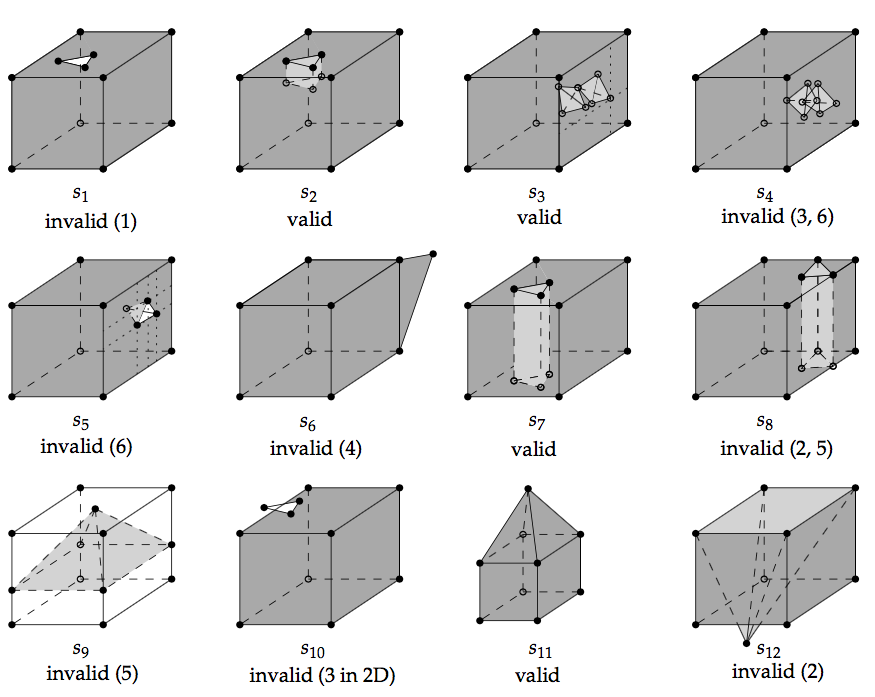
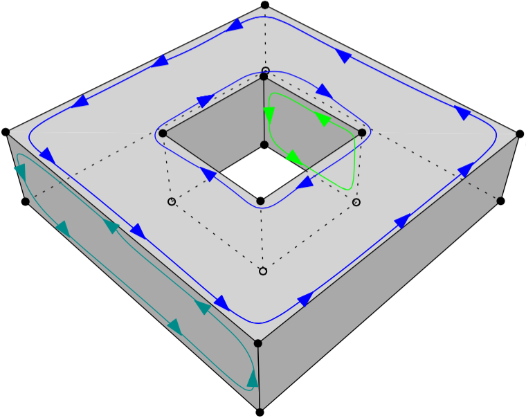

.. _def:

===========
Definitions
===========

The international standard `ISO19107 <https://www.iso.org/standard/66175.html>`_ provides definitions for the 3D primitives as used in GIS applications and the "geo-world".
Because the aim is to represent *all* the possible real-world features, the 3D primitives are more complex than that in other fields (where often-times a volumetric object is restricted to be a 2-manifold, and where inner rings in surfaces are disallowed), or that of 3D objects in several commercial 3D GIS packages (where the 3D primitives are simply not defined and where inner boundaries in surfaces and solids are disallowed).

ISO19107 primitives
-------------------

The 3D primitives as defined in `ISO19107 <https://www.iso.org/standard/66175.html>`_ are a generalisation to 3D of the 2D ones and are as follows:

A 0D primitive is a ``GM_Point``, a 1D a ``GM_Curve``, a 2D a ``GM_Surface``, and a 3D a ``GM_Solid``.
A *d*-dimensional primitive is built with a set of (*d*-1)-dimensional primitives, eg a ``GM_Solid`` is formed by several ``GM_Surfaces``, which are formed of several ``GM_Curves``, which are themselves formed of ``GM_Point``.

.. note::
  While the ISO19107 primitives do not need to be linear or planar (eg curves defined by mathematical functions are allowed), val3dity uses the following restrictions (which are the same as the `international standard CityGML <https://www.ogc.org/standard/CityGML/>`_ and most (all perhaps?) 3D GIS):
    
    1. ``GM_Curves`` can only be *linear*; 
    2. ``GM_Surfaces`` can only be *planar*.

Aggregates & composites
-----------------------

Primitives can be combined into either *aggregates* or *composites*.

An aggregate is an arbitrary collection of primitives of the same dimensionality that is simply used to bundle together geometries.
GML (and CityGML) has classes for each dimensionality (``Multi*``).
An aggregate does not prescribe any topological relationships between the primitives, it is simply a list of primitives (ie they can overlap or be disconnected).

A composite of dimension *d* is a collection of *d*-dimensional primitives that form a *d*-manifold, which is a topological space that is locally like a *d*-dimensional Euclidean space (:math:`\mathbb{R}^d`). 
The most relevant example in a GIS context is a ``CompositeSurface``: it is a 2-manifold, or, in other words, a surface embedded in :math:`\mathbb{R}^d`.
An obvious example is the surface of the Earth, for which near to every point the surrounding area is topologically equivalent to a plane. 

Overview of 3D primitives handled
---------------------------------

Observe that for a primitive to be valid, all its lower-dimensionality primitives have to be valid.
For instance, a valid Solid cannot have as one of its surfaces a Polygon having a self-intersection (which would make it invalid).

.. _def_polygon:

``Polygon``
-----------
A Polygon in the context of val3dity is always embedded in :math:`\mathbb{R}^d`, ie its vertices have (*x, y, z*) coordinates.
To be valid, it needs to fulfil the 6 assertions below, which are given on pages 27-28 of the `Simple Features document <http://portal.opengeospatial.org/files/?artifact_id=25355>`_.
These rules are verified by first projecting each Polygon to a plane, this plane is obtained in val3dity by least-square adjustment of all the points of a Polygon.
A Polygon must also be *planar* to be valid: its points (used for both the exterior and interior rings) have to lie on a plane (see :ref:`e203` and :ref:`e204` more information about this).

Some concrete examples of invalid polygons are shown below, and here are a few explanations:

  - Each ring should be closed (:math:`p_{11}`): its first and its last points should be the same.
  - Each ring defining the exterior and interior boundaries should be simple, ie non-self-intersecting (:math:`p_{1}` and :math:`p_{10}`). Notice that this prevents the existence of rings with zero-area (:math:`p_{6}`), and of rings having two consecutive points at the same location. It should be observed that the polygon :math:`p_{1}` is not allowed (in a valid representation of the polygon, the triangle should be represented as an interior boundary touching the exterior boundary).
  - The rings of a polygon should not cross (:math:`p_{3}`, :math:`p_{7}`, :math:`p_{8}` and :math:`p_{12}`) but may intersect at one tangent point (the interior ring of :math:`p_{2}` is a valid case, although :math:`p_{2}` as a whole is not since the other interior ring is located outside the interior one). More than one tangent point is allowed, as long as the interior of the polygon stays connected (see below).
  - A polygon may not have cut lines, spikes or punctures (:math:`p_{5}` or :math:`p_{6}`); removing these is known as the regularisation of a polygon (a standard point-set topology operation).
  - The interior of every polygon is a connected point set (:math:`p_{4}`).
  - Each interior ring creates a new area that is disconnected from the exterior. Thus, an interior ring cannot be located outside the exterior ring (:math:`p_{2}`) or inside other interior rings (:math:`p_{9}`).

----

.. _def_multisurface:

``MultiSurface``
----------------
It is an arbitrary collection of :ref:`def_polygon`.
Validating a ``MultiSurface`` simply means that each Polygon is validated individually; a ``MultiSurface`` is valid if all its ``Polygons`` are valid.

----

``CompositeSurface`` 
--------------------
Besides that each Polygon must be individually valid, the Polygons forming a ``CompositeSurface`` are not allowed to overlap and/or to be disjoint.
Furthermore, if we store a ``CompositeSurface`` in a data structure, each edge is guaranteed to have a maximum of two incident surfaces, and around each vertex the incident faces form one 'umbrella'.

----

``Solid``
---------

A ``CompositeSurface`` that is closed (ie it contains no 'holes', it is 'watertight') and orientable is referred to as a "Shell".
Shells are used to define the boundaries of a ``Solid``.
In the figure above, the ``Solid`` has two boundaries: an exterior one (the cube in grey) and one interior one (the cube in orange), which defines a `void' in the solid.
A ``Solid`` can have an infinity of interior boundaries, or none.
Observe that a cavity is not the same as a hole in a torus (a donut) such as that in the figure below: it can be represented with one exterior boundary having a genus of 1 and no interior shell.
Interior boundaries in surfaces are possible, simple LOD1 buildings having for instance an inner yard require them.

According to the ISO19107 specifications, the different boundaries of a solid are allowed to interact with each other, but only under certain circumstances.
Since there is no implementation specifications for 3D primitives, we have to generalise the 2D assertions for the validity of a 2D polygon (see :ref:`def_multisurface`).
Observe that all of them, except the 3rd, generalise directly to 3D since a point-set topology nomenclature is used.
The only modifications needed are that, in 3D, polygons become solids, rings become shells, and holes become cavities.

To further explain what the assertions are in 3D, the figure below shows 12 solids, some of them valid, some not; all the statements below refer to these solids.

The first assertion means that a solid must be closed, or 'watertight' (even if it contains interior shells).
The solid :math:`s_1` is thus not valid but :math:`s_2` is since the hole in the top surface is 'filled' with other surfaces.

The second assertion implies that each shell must be *simple* (ie a 2-manifold).

The third assertion means that the boundaries of the shells can intersect each others, but the intersection between the shells can only contain primitives of dimensionality 0 (vertices) and 1 (edges).
If a surface or a volume is contained, then the solid is not valid.
The solid :math:`s_3` is an example of a valid solid: it has two interior shells whose boundaries intersect at one point (at the apexes of the tetrahedra), and the apex of one of the tetrahedra is coplanar with the 4 points forming one surface of the exterior shell.
If the interior of the two interior shells intersects (as in :math:`s_4`) the solid is not valid; this is also related to the sixth assertion stating that each cavity must define one connected component: if the interior of two cavities are intersecting they define the same connected component.
Notice also that :math:`s_5` is not valid since one surface of its cavity intersects with one surface of the exterior shell (they "share a surface"); :math:`s_5` should be represented with one single exterior shell (having a 'dent'), and no interior shell.

The fourth assertion states that a shell is a 2-manifold and that no dangling pieces can exist (such as that of :math:`s_6`); it is equivalent to the *regularisation* of a point-set in 3D.

The fifth assertion states that the interior of a solid must form a connected point-set (in 3D).
Consider the solid :math:`s_7`, it is valid since its interior is connected and it fulfils the other assertions; notice that it is a 2-manifold but that unlike other solids in the figure (except :math:`s_8`) its `genus <http://en.wikipedia.org/wiki/Genus_(mathematics)>`_) is 1.
If we move the location of the triangular prism so that it touches the boundary of the exterior shell (as in :math:`s_8`), then the solid becomes invalid since its interior is not connected anymore, and also since its exterior shell is not simple anymore (2 edges have 4 incident planar faces, which is not 2-manifold).
It is also possible that the interior shell of a solid separates the solid into two parts: the interior shell of :math:`s_9` (exterior shell is not coloured for clarity) is a pyramid having four of its edges intersecting with the exterior shell, but no two surfaces are shared, thus these interactions are allowed.
However, the presence of the pyramid separates the interior of the solid into two unconnected volumes (violating assertion 5); for both :math:`s_8` and :math:`s_9`, the only possible valid representation is with two different solids.

Notice also that, as for other primitives, for a solid to be valid all its lower-dimensionality primitives must be valid.
That is, each surface of the shells has to be valid.
An example of an invalid surface would be one having a hole (an inner ring) overlapping the exterior ring (see :math:`s_{10}`).

Furthermore, it should also be noticed that for a solid to be valid both its topology and its geometry should be valid.
A solid such as :math:`s_{11}` is valid, but if the location of only one of its vertices is modified (for instance if the apex of the pyramid of :math:`s_{11}` is moved downwards to form :math:`s_{12}`) then it becomes invalid. 
Both :math:`s_{11}` and :math:`s_{12}` can be represented with a graph having exactly the same topology (which is valid for both), but if we consider the geometry then the latter solid is not valid since its exterior shell is not simple.

Lastly, the orientation of the polygons must be considered.
In 2D, the only requirement for a polygon is that its exterior ring must have the opposite orientation of that of its interior ring(s) (eg clockwise versus counterclockwise).
In 3D, if one polygon is used to construct a shell, its exterior ring must be oriented in such as way that, when viewed from the outside of the shell, the points are ordered counterclockwise.
See for instance this solid and the orientation of three of its polygons (different colours).

In other words, the normal of the surface must point outwards if a right-hand system is used, ie when the ordering of points follows the direction of rotation of the curled fingers of the right hand, then the thumb points towards the outside. 
If the polygon has interior rings, then these have to be ordered clockwise.

----

``MultiSolid``
--------------
It is an arbitrary collection of ``Solids``.
Validating a ``MultiSolid`` simply means that each ``Solid`` is validated individually; a ``MultiSolid`` is valid if all its ``Solids`` are valid.

----

``CompositeSolid``
------------------
Besides that each ``Solid`` must be individually valid, the ``Solids`` are not allowed to overlap and/or to be disjoint.

A ``CompositeSolid``, formed by the ``Solids`` *A* and *B*, should fulfil the following two properties:

  1. their interior should not overlap (:math:`A^{o} \cap B^{o} = \emptyset`)
  2. their union should form one ``Solid`` (:math:`A \cup B =` one Solid)

val3dity can validate these with a user-defined tolerance (see the option :ref:`option_overlap_tol`), to ignore small overlaps/gaps that often arise in practice.

