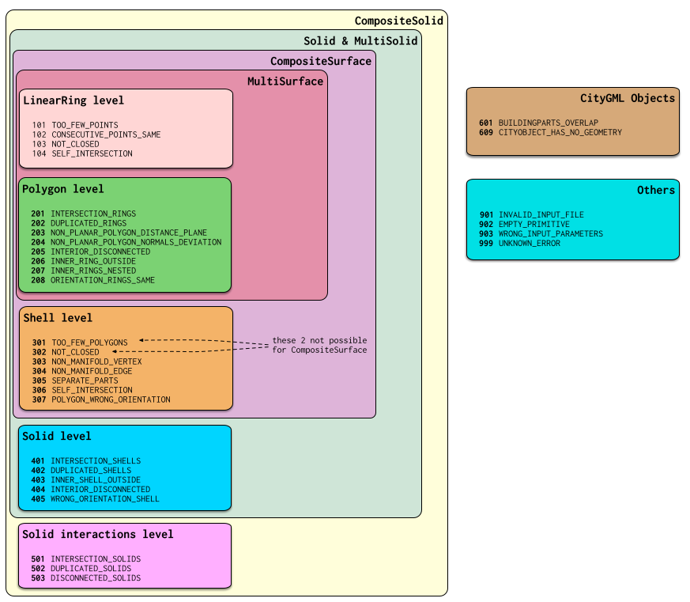
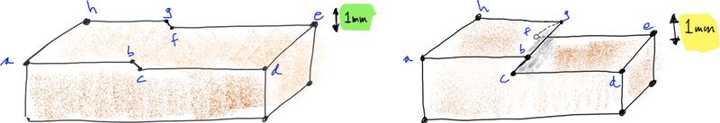
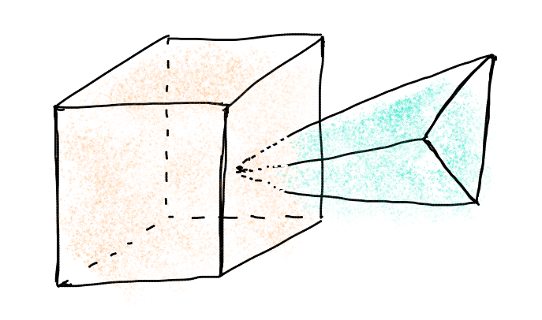
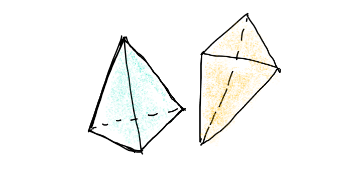

======
Errors
======

.. contents:: :local:

.. _error_101:

101 -- TOO_FEW_POINTS
---------------------

A ring should have at least 3 points. For GML rings, this error ignores the fact that the first and the last point of a ring are the same (see :ref:`error_103`), ie a GML ring should have at least 4 points.

This ring is for instance invalid:

.. code-block:: xml

  <gml:LinearRing>
    <gml:pos>0.0 0.0 0.0</gml:pos>
    <gml:pos>1.0 0.0 0.0</gml:pos>
    <gml:pos>0.0 0.0 0.0</gml:pos>
  </gml:LinearRing>

.. _error_102:

102 -- CONSECUTIVE_POINTS_SAME 
------------------------------
Points in a ring should not be repeated (except first-last in case of GML, see :ref:`error_103`). This error is for the common error where 2 *consecutive* points are at the same location. Error 104 is for points in a ring that are repeated, but not consecutive. 

This ring is for instance invalid:

.. code-block:: xml

  <gml:LinearRing>
    <gml:pos>0.0 0.0 0.0</gml:pos>
    <gml:pos>1.0 0.0 0.0</gml:pos>
    <gml:pos>1.0 0.0 0.0</gml:pos>
    <gml:pos>1.0 1.0 0.0</gml:pos>
    <gml:pos>0.0 1.0 0.0</gml:pos>
    <gml:pos>0.0 0.0 0.0</gml:pos>
  </gml:LinearRing>

.. _error_103:

103 -- NOT_CLOSED 
-----------------

*This applies only to GML rings, in CityJSON/OBJ/OFF it is ignored.* 
The first and last points have to be identical (at the same location). 
This is verified after the points have been merged with the :ref:`snap_tol` option.

This ring is for instance invalid:

.. code-block:: xml

  <gml:LinearRing>
    <gml:pos>0.0 0.0 0.0</gml:pos>
    <gml:pos>1.0 0.0 0.0</gml:pos>
    <gml:pos>1.0 1.0 0.0</gml:pos>
    <gml:pos>0.0 1.0 0.0</gml:pos>
  </gml:LinearRing>

.. _error_104:

104 -- SELF_INTERSECTION 
------------------------
A ring should be *simple*, ie it should not self-intersect. The self-intersection can be at the location of an explicit point, or not. This case includes rings that are (partly) collapsed to a line for instance.

Observe that self-intersection in 3D and 2D is different, ie a bowtie (the first polygon below) has a self-intersection "in the middle" in 2D, but in 3D if the 4 vertices are not on a plane then there is no intersection.

.. image:: _static/104.png
   :width: 80%

A ring is self-intersecting if its projection to the best-fitted plane (done with least-square) through the vertices of the polygon containing the ring has a self-intersection.
This rule is there because if it is not possible to project the rings/polygons to a plane, then it is not possible to triangulate it (which is necessary, at least by val3dity, to validate 3D primitives).
In the figure below, the left example shows one polygon (the top one) where a projection (let say to the xy-plane) would not cause any self-intersection.
However, the right example does cause a self-intersection.
It is the same is the vertices *b* and *c* are projected to the same location: a self-intersection is also returned.

.. _error_201:

201 -- INTERSECTION_RINGS
-------------------------
Two or more rings intersect, these can be either the exterior ring with an interior ring or only interior rings. 

.. image:: _static/201.png
   :width: 50%

.. _error_202:

202 -- DUPLICATED_RINGS
-----------------------
Two or more rings are identical.

.. _error_203:

203 -- NON_PLANAR_POLYGON_DISTANCE_PLANE
----------------------------------------

A polygon must be planar, ie all its points (used for both the exterior and interior rings) must lie on a plane. 
To verify this, we must ensure that the the distance between every point and a plane is less than a given *tolerance* (eg 1cm). 
In the validator, this plane is fitted with least-square adjustment, and the distance between each of the point to the plane is calculated. 
If the distance is larger than the given threshold then an error is reported. 
The distance to the plane, if larger than the threshold, is also reported in the report.

.. _error_204:

204 -- NON_PLANAR_POLYGON_NORMALS_DEVIATION
-------------------------------------------

To ensure that small folds on a surface are detected. Consider the Solid below, the top surface containing 8 vertices (*abcdefgh*) is clearly non-planar since there is a vertical "fold" in the middle. 
The normal of the sub-surface *abgh* points upwards, while that of *bcfg* points in a different angle. 
But this surface would not be detected by the :ref:`error_203` test (with a tolerance of 1cm for instance) since all the vertices are within that threshold. 
Thus, another requirement is necessary: the distance between every point forming a polygon and *all* the planes defined by all possible combinations of 3 non-collinear points is less than a given tolerance. 
In practice it can be implemented with a triangulation of the polygon (any triangulation): the orientation of the normal of each triangle must not deviate more than than a certain user-defined tolerance. 

A surface is first checked for :ref:`error_203`, if it’s valid then :ref:`error_204` is checked. 
However, it is only checked if there are no :ref:`error_104` in the polygon, since otherwise it's not possible to triangulate the polygon.
In the figure below, the Solid on the left could be tested for 204, while the right one couldn't (but an :ref:`error_104` would be returned).

By definition, if :ref:`error_204` is reported then all the vertices are within 1cm (or the tolerance you gave as input), thus you wouldn’t be able to visualise them.
Also, 204 usually means that the vertices in the polygon are *very* close to each other (say 0.1mm), and thus it’s easy to get a large deviation (say 80 degree; the report contains the actual deviation).

.. _error_205:

205 -- INTERIOR_DISCONNECTED
----------------------------
The interior of a polygon must be connected. The combination of different valid rings can create such an error, for example:

.. image:: _static/205.png
   :width: 25%

.. _error_206:

206 -- INNER_RING_OUTSIDE
-------------------------
One or more interior rings are located *completely* outside the exterior ring. If the interior ring intersects the exterior ring (even at only one point), then error :ref:`error_201` should be returned.

.. image:: _static/206.png
   :width: 25%

.. _error_207:

207 -- INNER_RINGS_NESTED
-------------------------
One or more interior ring(s) is(are) located completely inside another interior ring.

.. image:: _static/207.png
   :width: 25%

.. _error_208:

208 -- ORIENTATION_RINGS_SAME 
-----------------------------
The interior rings must have the opposite direction (clockwise vs counterclockwise) when viewed from a given point-of-view. 
When the polygon is used as a bounding surface of a shell, then the rings have to have a specified orientation (see 307/308).

.. image:: _static/208.png
   :width: 25%

.. _error_301:

301 -- TOO_FEW_POLYGONS
-----------------------
A shell should have at least 4 polygons---the simplest volumetric shape in 3D is a tetrahedron.

.. _error_302:

302 -- NOT_CLOSED
-----------------
The shell must not have 'holes', ie it must be 'watertight'. This refers only to the topology of the shell, not to its geometry (see :ref:`error_306`).

The left solid is invalid, while the right one is valid (since the hole is filled with other polygons):

.. image:: _static/302.png

.. _error_303:

303 -- NON_MANIFOLD_CASE
------------------------
Each shell must be simple, ie it must be a 2-manifold. Two cases are possible:

  1. An edge of a shell is non-manifold when there are more than 2 incident polygons to it.
  2. A vertex is non-manifold when its incident polygons do not form one 'umbrella'

.. image:: _static/303.png

.. image:: _static/304.png

.. _error_305:

305 -- MULTIPLE_CONNECTED_COMPONENTS
------------------------------------
Polygons that are not connected to the shell should be reported as an error. 

.. image:: _static/305.png

.. _error_306:

306 -- SELF_INTERSECTION
------------------------
If topology of the shell is correct and the shell is closed (thus no error 301/302/303/304/305), it is possible that the geometry introduces errors, eg intersections. 
For instance, the topology of both these shells is identical, but the geometry differs. 
The left shell is valid while the right one is invalid.

.. image:: _static/306.png

.. _error_307:

307 -- POLYGON_WRONG_ORIENTATION
--------------------------------
If one polygon is used to construct a shell, its exterior ring must be oriented in such as way that when viewed from outside the shell the points are ordered counterclockwise.

.. _error_401:

401 -- INTERSECTION_SHELLS
--------------------------
The interior of two or more shells intersect, these can be either the exterior shells with an interior shells or two or more interior shells. 
Two shells sharing (part of) a face is also not allowed.

Conceptually the same as :ref:`error_201`.

.. _error_402:

402 -- DUPLICATED_SHELLS
------------------------
Two or more shells are identical in *one* Solid. Note that for example a MultiSolid is a collection of Solids, but the topological relationships between them are not prescribed at all, they can be duplicated.

Conceptually the same as :ref:`error_202`.

.. _error_403:

403 -- INNER_SHELL_OUTSIDE
--------------------------
One or more interior shells are located *completely* outside the exterior shell. If the interior shell intersects the exterior shell (even at only one point), then error :ref:`error_401` should be returned.

Conceptually the same as :ref:`error_206`.

.. _error_404:

404 -- INTERIOR_DISCONNECTED
----------------------------
Conceptually the same as :ref:`error_205`: the configuration of the interior shells makes the interior of the solid disconnected. 

.. _error_405:

405 -- WRONG_ORIENTATION_SHELL
------------------------------
The polygon/surfaces forming an outer shell should have their normals pointing outwards, and for an interior shell inwards. 

'Outwards' is as follows: if a right-hand system is used, ie when the ordering of the points on the surface follows the direction of rotation of the curled fingers of the right hand, then the thumb points towards the outside. 
The torus below shows the correct orientation for some rings of some faces.

Conceptually the same as :ref:`error_208`.

.. image:: _static/orientation.png
   :width: 50%

.. _error_501:

501 -- INTERSECTION_SOLIDS
--------------------------
The interior of 2 ``Solids`` part of a ``CompositeSolid`` intersects.

.. _error_502:

502 -- DUPLICATED_SOLIDS
------------------------
Two ``Solids`` in a ``CompositeSolid`` are identical.

.. _error_503:

503 -- DISCONNECTED_SOLIDS
--------------------------
Two ``Solids`` in a ``CompositeSolid`` are disconnected.

.. _error_601:

601 -- BUILDINGPARTS_OVERLAP
----------------------------
Some primitives in a Building and/or BuildingPart have their interior overlapping.

.. _error_609:

609 -- CITYOBJECT_HAS_NO_GEOMETRY
---------------------------------
The CityGML object (a Building, a Bridge, a Road, etc.) has no geometry defined.
That is, it has no 3D Primitives declared as geometry, for instance for a Building there no tags ``<lod2Solid>`` or ``<lod2MultiSurface>``.
If with a viewer you can see the geometry of the CityGML object, then that error occurs because the surfaces are *only* declared as semantic surfaces (the surfaces are children of the tag ``<boundedBy>``).
To circumvent the issue, we advise you to add a geometry to your objects, this is an error that could affect many processes and software.
Another option is to use the option ``--geom_is_sem_surfaces`` which gathers all the semantic surfaces of a City Object and validates them.
We only offer this option as a convenience (and because we are nice people), and we strongly encourage you to define a geometry.

.. _error_901:

901 -- INVALID_INPUT_FILE
-------------------------
Input file is not valid or corrupted. If a CityGML file, you can `check it against the schema <http://geovalidation.bk.tudelft.nl/schemacitygml/>`_.

.. _error_902:

902 -- EMPTY_PRIMITIVE
----------------------
The input file contains empty primitives, eg an OBJ where to surfaces are defined, or a ``CompositeSolid`` in a CityJSON file containing one empty Solid.

.. _error_903:

903 -- WRONG_INPUT_PARAMETERS
-----------------------------
The parameters used for the validation are not valid.

.. _error_999:

999 -- UNKNOWN_ERROR
--------------------
If none of the above but something went bad. If this happens `please report it <https://github.com/tudelft3d/val3dity/issues>`_.
