======
Errors
======

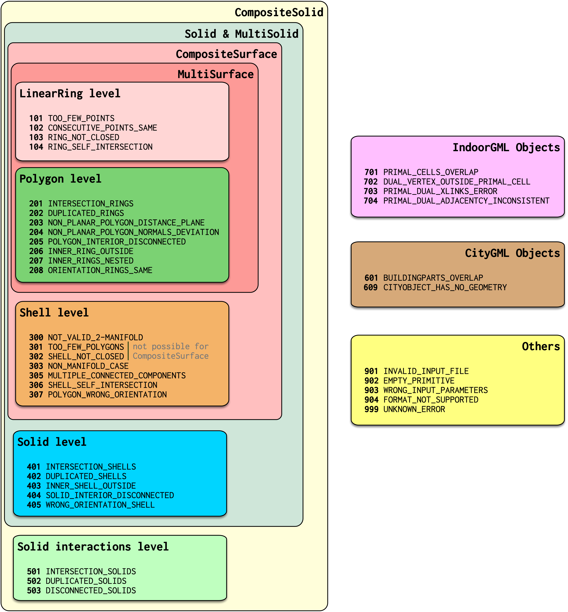

.. contents:: :local:

101 -- TOO_FEW_POINTS
---------------------

A ring should have at least 3 points. For GML rings, this error ignores the fact that the first and the last point of a ring are the same (see 103), ie a GML ring should have at least 4 points. |

This ring is for instance invalid:

.. code-block:: xml

  <gml:LinearRing>
    <gml:pos>0.0 0.0 0.0</gml:pos>
    <gml:pos>1.0 0.0 0.0</gml:pos>
    <gml:pos>0.0 0.0 0.0</gml:pos>
  </gml:LinearRing>

102 -- CONSECUTIVE_POINTS_SAME 
------------------------------
Points in a ring should not be repeated (except first-last in case of GML, see 103). This error is for the common error where 2 *consecutive* points are at the same location. Error 104 is for points in a ring that are repeated, but not consecutive. 

This ring is for instance invalid:

.. code-block:: xml

  <gml:LinearRing>
    <gml:pos>0.0 0.0 0.0</gml:pos>
    <gml:pos>1.0 0.0 0.0</gml:pos>
    <gml:pos>1.0 0.0 0.0</gml:pos>
    <gml:pos>1.0 1.0 0.0</gml:pos>
    <gml:pos>0.0 1.0 0.0</gml:pos>
    <gml:pos>0.0 0.0 0.0</gml:pos>
  </gml:LinearRing>

103 -- NOT_CLOSED 
-----------------
*This applies only to GML rings, if OBJ/OFF used it's ignored*. The first and last points have to be identical (at the same location). 
This is verified after the points have been merged with the :ref:`snap_tol` option (default is 0.001unit). 

This ring is for instance invalid:

.. code-block:: xml

  <gml:LinearRing>
    <gml:pos>0.0 0.0 0.0</gml:pos>
    <gml:pos>1.0 0.0 0.0</gml:pos>
    <gml:pos>1.0 1.0 0.0</gml:pos>
    <gml:pos>0.0 1.0 0.0</gml:pos>
  </gml:LinearRing>

104 -- SELF_INTERSECTION 
------------------------
A ring should be *simple*, ie it should not self-intersect. The self-intersection can be at the location of an explicit point, or not.

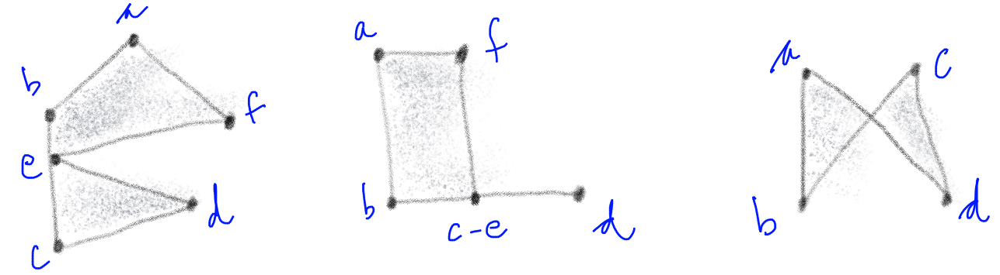

105 -- COLLAPSED_TO_LINE 
------------------------
A special case of self-intersection (104): the ring is collapsed to a line. If the geometry is collapsed to a point, then 101/102 is used. 

.. image:: _static/105.png

201: INTERSECTION_RINGS
-----------------------
Two or more rings intersect, these can be either the exterior ring with an interior ring or only interior rings. 

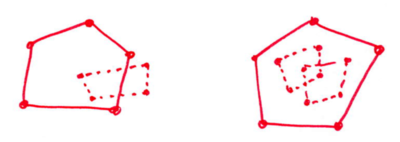

202: DUPLICATED_RINGS
---------------------
Two or more rings are identical.

.. _error_203:

203: NON_PLANAR_POLYGON_DISTANCE_PLANE
--------------------------------------
A polygon must be planar, ie all its points (used for both the exterior and interior rings) must lie on a plane. 
To verify this, we must ensure that the the distance between every point and a plane is less than a given *tolerance* (eg 1cm). 
In the validator, this plane is fitted with least-square adjustment, and then the distance between each of the point to the plane is calculated. 
If it is larger than the given threshold (0.01unit by default; can be changed as a parameter) then an error is reported. 
The distance to the plane, if larger than the threshold, is also reported in the report.

.. _error_204:

204: NON_PLANAR_POLYGON_NORMALS_DEVIATION
-----------------------------------------
To ensure that cases such as that below are detected, error 204 is introduced. In the solid, the top surface containining 8 vertices (*abcdefgh*) is clearly non-planar since there is a vertical "fold" in the middle. 
The normal of the sub-surface *abgh* points upwards, while that of *bcfg* is perpendicular to it. 
But this surface would not be detected the error 203 test and a tolerance of 1cm for instance, since all the vertices are within that thresfold. 
Thus, another requirement is necessary: the distance between every point forming a polygon and *all* the planes defined by all possible combinaisons of 3 non-colinear points is less than a given tolerance. 
In practice it can be implemented with a triangulation of the polygon (any triangulation): the orientation of the normal of each triangle must not deviate more than than a certain usef-defined tolerance; this tolerance is in val3dity set to 1 degree, but can be defined (not in the web-version), but in the executable. 

A surface is first checked for error 203, if valid then error 204 is checked. 
By definition, if an error 204 is reported then all the vertices are within 1cm (tolerance you used), thus you wouldn’t be able to visualise them. 
That usually means that you have vertices that are very close (say 0.1mm) and thus it’s easy to get a large deviation (say 80degree; the report contains the deviation).

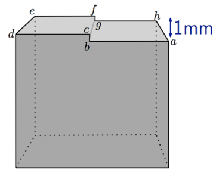

205: INTERIOR_DISCONNECTED
--------------------------
The interior of a polygon must be connected. The combinaison of different valid rings can create such an error, for example:

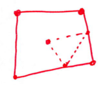

206: INNER_RING_OUTSIDE
-----------------------
One or more interior ring(s) is(are) located completely outside the exterior ring. If the interior ring intersects the exterior ring, then error 201 should be returned.

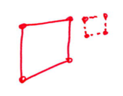

207: INNER_RINGS_NESTED
-----------------------
One or more interior ring(s) is(are) located completely inside another interior ring.

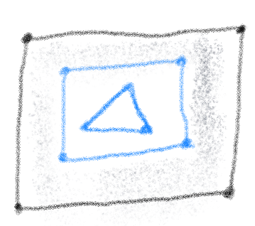

208: ORIENTATION_RINGS_SAME 
---------------------------
The interior rings must have the opposite direction (clockwise vs counterclockwise) when viewed from a given point-of-view. 
When the polygon is used as a bounding surface of a shell, then the rings have to have a specified orientation (see 307/308).

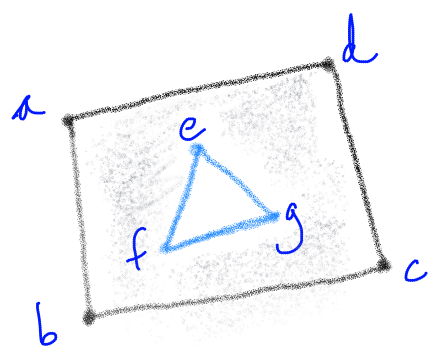

 
301 -- TOO_FEW_POLYGONS
-----------------------
A shell should have at least 4 polygons---the simplest volumetric shape in 3D is a tetrahedron.

302 -- NOT_CLOSED
-----------------
The shell must not have 'holes', ie it must be 'watertight'. This refers only to the topology of the shell, not to its geometry (see 306).

The left solid is invalid, while the right one is valid (since the hole is filled with other polygons):

.. image:: _static/302.png

303 -- NON_MANIFOLD_VERTEX
--------------------------
Each shell must be simple, ie it must be a 2-manifold. A vertex is non-manifold when its incident polygons do not form one 'umbrella':

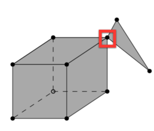

304 -- NON_MANIFOLD_EDGE
------------------------
Each edge of a shell should have exactly 2 incident polygons.

.. image:: _static/304.png

305 -- MULTIPLE_CONNECTED_COMPONENTS
------------------------------------
Polygons that are not connected to the shell should be reported as an error. 

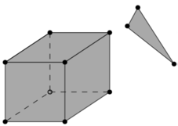

306 -- SELF_INTERSECTION
------------------------
If topology of the shell is correct and the shell is closed (thus no error 301/302/303/304/305), it is possible that the geometry introduces errors, eg intersections. 
For instance, the topology of both these shells is identical, but the geometry differs. 
The left shell is valid while the right one is invalid.

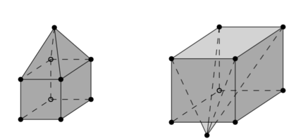

307 -- POLYGON_WRONG_ORIENTATION
--------------------------------
If one polygon is used to construct a shell, its exterior ring must be oriented in such as way that when viewed from outside the shell the points are ordered counterclockwise.

.. _error_309:

309 -- VERTICES_NOT_USED
------------------------
In an OBJ/OFF/POLY, all the vertices are listed and the primitives use references to these. 
If some vertices are not used then this error is reported.
(City)GML cannot report this error

401 -- INTERSECTION_SHELLS
--------------------------
The interior of 2 shells intersects or they share a face, which is not allowed. 

402 -- DUPLICATED_SHELLS
------------------------
Two shells are identical.

403 -- INNER_SHELL_OUTSIDE
--------------------------
One or more interior shells are completely located outside the exterior shell. Conceptually the same as 206.

404 -- INTERIOR_DISCONNECTED
----------------------------
Conceptually the same as 205: the configuration of the interior shells makes the interior of the solid disconnected. 

405 -- WRONG_ORIENTATION_SHELL
------------------------------
The polygon/surfaces forming an outer shell should have their normals pointing outwards, and for an interior shell inwards. 
Conceptually the same as 208.

501 -- INTERSECTION_SOLIDS
--------------------------
The interior of 2 Solids part of a CompositeSolid intersects.

502 -- DUPLICATED_SOLIDS
------------------------
Two Solids in a CompositeSolid are identical.

503 -- DISCONNECTED_SOLIDS
--------------------------
Two Solids in a CompositeSolid are disconnected.

.. _error_601:

601 -- BUILDINGPARTS_OVERLAP
----------------------------
Some primitives in a Building and/or BuildingPart have their interior overlapping.

901 -- INVALID_INPUT_FILE
-------------------------
Input file is not valid, most likely not a valid CityGML file. `Check here for CityGML files <http://geovalidation.bk.tudelft.nl/schemacitygml/>`_.

902 -- EMPTY_PRIMITIVE
----------------------
The input file contains empty primitives, which is perhaps due to a complex GML representation.

903 -- WRONG_INPUT_PARAMETERS
-----------------------------
The parameters used for the validation are not valid.

999 -- UNKNOWN_ERROR
--------------------
If none of the above but something went bad. If this happens `please report it <https://github.com/tudelft3d/val3dity/issues>`_.