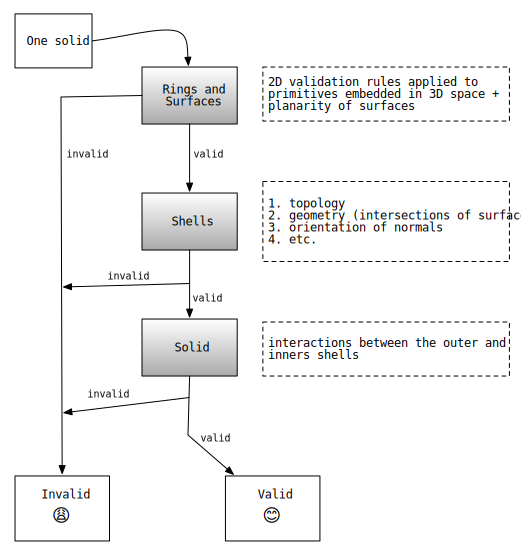
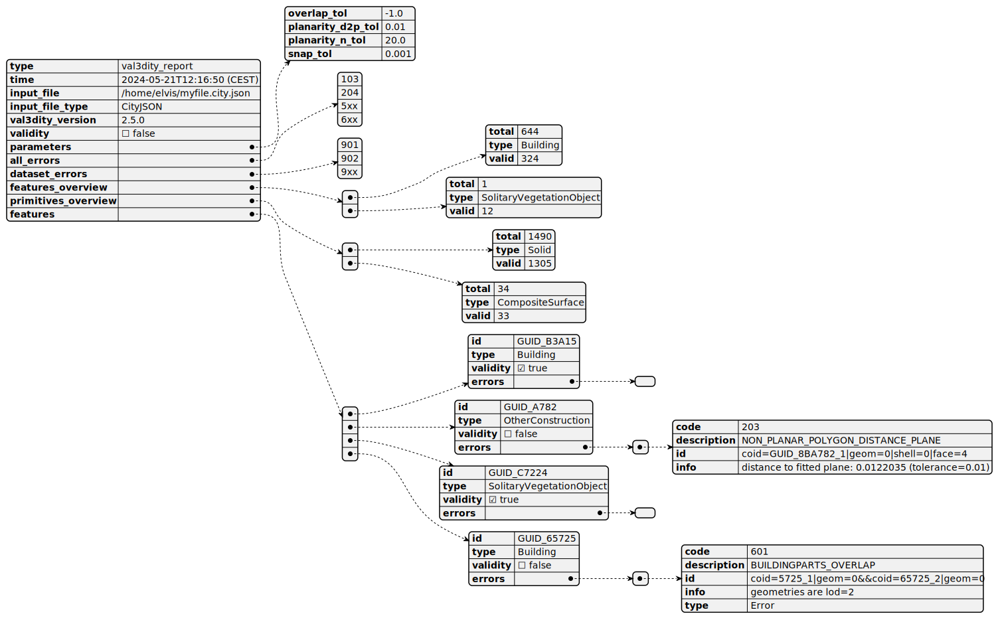
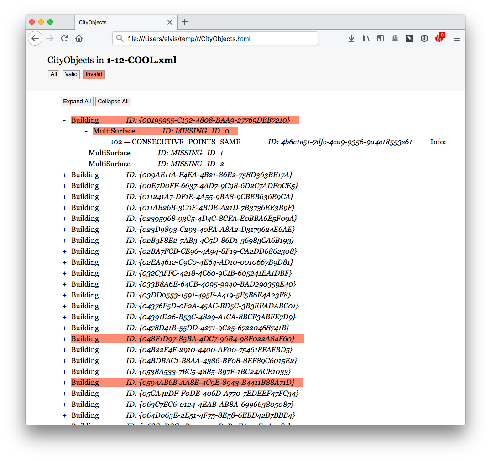
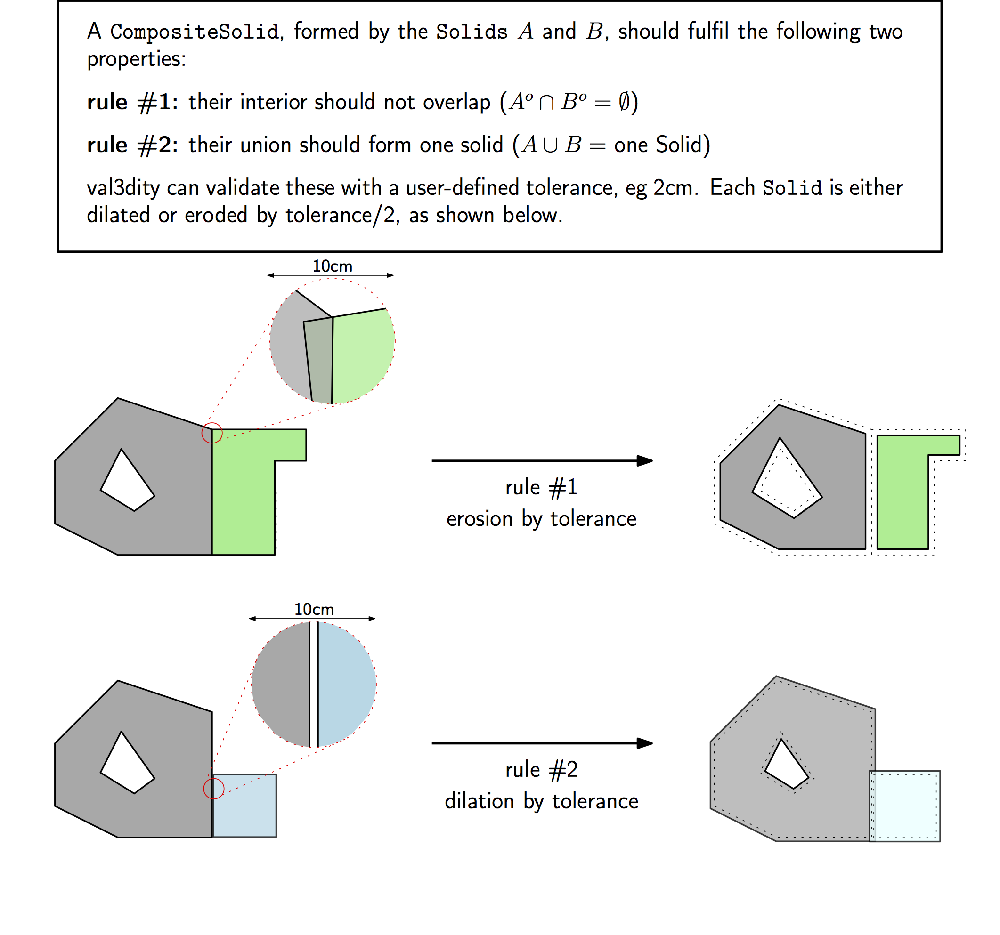

==============
Using val3dity
==============

.. note::

  val3dity is a command-line program only, there is no graphical interface. Alternatively, you can use the `web application <http://geovalidation.bk.tudelft.nl/val3dity>`_.

How to run val3dity?
--------------------

To execute val3dity and see its options:

.. code-block:: bash

  val3dity --help
    

To validate all the 3D primitives in a CityJSON file and see a summary output:

.. code-block:: bash

  val3dity my3dcity.city.json 

To validate each 3D primitive in ``input.city.json``, and use a tolerance for testing the planarity of the surface of 20cm (0.2):

.. code-block:: bash

  val3dity --planarity_d2p_tol 0.2 input.city.json

To validate an OBJ file and verify whether the 3D primitives from a Solid (this is the default):

.. code-block:: bash

  val3dity input.obj 

The same file could be validated as a MultiSurface, ie each of its surface are validated independently

.. code-block:: bash

  val3dity -p MultiSurface input.obj

Using CityJSONSeq
-----------------

To validate a `CityJSONSeq stream <https://www.cityjson.org/cityjsonseq/>`_, you need to pipe the stream into val3dity and use ``stdin`` for the input. 

If you have a CityJSONSeq serialised in a file, then you can cat it:

.. code-block:: bash

  cat myfile.city.jsonl | val3dity stdin

The output shows, line by line, what are the errors. If the list of error is empty (``[]``) this means the feature is geometrically valid.

  

Accepted input
--------------

val3dity accepts as input:

  - `CityJSON <http://www.cityjson.org>`_
  - `CityJSON Sequences (CityJSONSeq) <https://www.cityjson.org/cityjsonseq/>`_
  - `tu3djson <https://github.com/tudelft3d/tu3djson>`_
  - `JSON-FG (OGC Features and Geometries JSON) <https://github.com/opengeospatial/ogc-feat-geo-json>`_
  - `OBJ <https://en.wikipedia.org/wiki/Wavefront_.obj_file>`_ 
  - `OFF <https://en.wikipedia.org/wiki/OFF_(file_format)>`_
  - `IndoorGML <http://indoorgml.net/>`_

For **CityJSON** files, all the City Objects (eg ``Building`` or ``Bridge``) are processed and their 3D primitives are validated.
The 3D primitives are bundled under their City Objects in the report.
If your CityJSON contains ``Buildings`` with one or more ``BuildingParts``, val3dity will perform an extra validation: it will ensure that the 3D primitives do not overlap (technically that the interior of each ``BuildingPart`` does not intersect with the interior of any other part of the ``Building``).
If there is one or more intersections, then :ref:`e601` will be reported.

For **CityJSONSeq** streams, the validation is performed line-by-line and the errors are returned for each line. 
If you want to generate a global report, you can serialise the stream into a `.jsonl file <https://berthub.eu/articles/posts/aws-and-microsoft-are-selling-much-more-than-cloud/>`_ and then validate this file as you would with any other input files.

For **IndoorGML** files, all the cells (in the primal subdivisions, the rooms) are validated individually, and then some extra validation tests are run on the dual navigation network. All errors 7xx are related specifically to IndoorGML.

For **JSON-FG** files, only ``Polyhedron`` and ``MultiPolyhedron`` are processed, the other possible types are ignored (``Prism``, ``MultiPrism``, and all the 2D types inherited from `GeoJSON <https://geojson.org/>`_). 
It should be noticed that the JSON-FG nomenclature is different: a ``Polyhedron`` is a ``Solid`` in val3dity, and a ``MultiPolyhedron`` is a ``MultiSolid`` in val3dity (an arbitrary aggregation of several solids and there is no assumption regarding their topological relationships).

For **OBJ** and **OFF** files, each primitive will be validated according to the ISO19107 rules. One must specify how the primitives should be validated (``MultiSurface``, ``CompositeSurface``, or ``Solid``).
In an OBJ file, if there is more than one object (lines starting with "o", eg `o myobject`), each will be validated individually.
Observe that OBJ files have no mechanism to define inner shells, and thus a solid will be formed by only its exterior shell.
Validating one primitive in an OBJ as a MultiSurface (``-p MultiSurface`` option) will individually validate each surface according to the ISO19107 rules, without ensuring that they form a 2-manifold.
If your OBJ contains triangles only (often the case), then using the option `-p MultiSurface` is rather meaningless since most likely all your triangles are valid. Validation could however catch cases where triangles are collapsed to a line/point.
Validating it as a solid verifies whether the primitive is a 2-manifold, ie whether it is closed/watertight and whether all normals are pointing outwards.

How are 3D primitives validated?
--------------------------------

All primitives are validated hierarchically, for instance:

  1. the lower-dimensionality primitives (the polygons) are validated by projecting them to a 2D plane (obtained with least-square adjustment) and using `GEOS <http://trac.osgeo.org/geos/>`_;
  2. then these are assembled into shells/surfaces and their validity is analysed, as they must be watertight, no self-intersections, orientation of the normals must be consistent and pointing outwards, etc;
  3. then the ``Solids`` are validated
  4. finally, for ``CompositeSolids`` the interactions between the ``Solids`` are analysed.

This means that if one polygon of a Solid is not valid, the validator will report that error but will *not* continue the validation (to avoid "cascading" errors). 

The formal definitions of the 3D primitives, along with explanations, are given in :doc:`definitions`.

How to interpret the report?
----------------------------

With the option ``--report`` a JSON report is output.

The report lists the errors at two levels:

  1. errors with the input files (errors 9xx)
  2. all other errors, per feature (eg for each Building the list of errors is given)

This is a diagram of the structure of the report; watch out not all options for the properties are shown.

The report contains several properties, one example: 

.. code-block:: json

  {
    "type": "val3dity_report",
    "time": "2024-05-21T12:16:50 (CEST)",
    "input_file": "/home/elvis/myfile.city.json",
    "input_file_type": "CityJSON",
    "val3dity_version": "2.5.0",
    "validity": false,
    "parameters": {
      "overlap_tol": -1.0,
      "planarity_d2p_tol": 0.01,
      "planarity_n_tol": 20.0,
      "snap_tol": 0.001
    },
    "all_errors": [102, 104, 203, 601],
    "dataset_errors": [],
    "features_overview": [
      {
        "total": 644,
        "type": "Building",
        "valid": 324
      },
      {
        "total": 1,
        "type": "TINRelief",
        "valid": 1
      }
    ],
    "primitives_overview": [
      {
        "total": 1490,
        "type": "Solid",
        "valid": 1305
      },
      {
        "total": 1,
        "type": "CompositeSurface",
        "valid": 1
      }
    ],
    "features": []
  }

The property ``"validity"`` is used to report whether the file is 100% valid, or not.
If it's invalid, then ``"all_errors"`` lists all the error codes present in the input file (the list is empty if the file is valid).

``"dataset_errors"`` lists all the errors related to the input file (errors 9xx).

``"features_overview"`` gives you an overview of the features in the file, in this case there were 644 Buildings and 1 TINRelief.

``"primitives_overview"`` gives you, similarly, an overview of the geometric primitives.

The ``"features"`` property list all the features in the file, and for each the errors are reported, if any.
An example is as follows:

.. code-block:: json

  {
    "features": [
      {
        "id": "GUID_0048B9B9-8028-4C01-9D55-6D96F0AB3A15",
        "type": "Building",
        "validity": true,
        "errors": []
      },
      {
        "id": "GUID_00D36CED-764E-4631-B88C-EA98528BA782",
        "type": "Building",
        "validity": false,
        "errors": [
          {
            "code": 203,
            "description": "NON_PLANAR_POLYGON_DISTANCE_PLANE",
            "id": "coid=GUID_00D36CED-764E-4631-B88C-EA98528BA782_1|geom=0|shell=0|face=4",
            "info": "distance to fitted plane: 0.0122035 (tolerance=0.01)"
          }
        ]
      },
      {
        "id": "GUID_00723D18-2A2C-47B4-ACF3-F5B6F4EC7224",
        "type": "Building",
        "validity": true,
        "errors": [],
      },
      {
        "id": "GUID_032A685A-1262-4157-A797-C9ED49A65725",
        "type": "Building",
        "validity": false,
        "errors": [
          {
            "code": 601,
            "description": "BUILDINGPARTS_OVERLAP",
            "id": "coid=GUID_032A685A-1262-4157-A797-C9ED49A65725_1|geom=0&&coid=GUID_032A685A-1262-4157-A797-C9ED49A65725_2|geom=0",
            "info": "geometries are lod=2",
            "type": "Error"
          }
        ]
      }
    ]
  } 

For each primitive, its identifier is (``"id"``) is given, its ``"type"``, and its ``"validity"``.
The ``"errors"`` property is always listed, and it is an array of the errors; it is an empty array if the feature is valid.

Because a feature (eg a Building) can contain several geometries and children (eg the BuildingPart of a Building), we report the error by giving extra information about its location.
``coid=`` tells you the City Object identifier.
``geom=0`` tells you that it's the first geometry in the list of geometries (if CityJSON is used), and similarly ``solid=1`` would indicate the second solid in a MultiSolid, ``shell=1`` would indicate that the 2nd shell in the Solid has an issue, and ``face=13`` would mean the 14th surface listed in the primitive has an issue.
A 0-based system is used for reporting. 

You can navigate this report with a JSON browser (eg drag it into an empty window in Firefox) or by loading it to the `val3dity report browser <http://geovalidation.bk.tudelft.nl/val3dity/browser/>`_:

There you get an overview of the statistics per features and primitives, and each feature has its errors as children.   

Options for the validation
--------------------------

``-h, --help``
*****************
|  Display usage information and exit.

----

``--ignore204``
***************
|  Ignore the error :ref:`e204`.

----

.. _option_overlap_tol:

``--overlap_tol``
*****************
|  Tolerance for testing the overlap between primitives in ``CompositeSolids`` and ``BuildingParts``
|  default = -1 (disabled)

The maximum allowed distance for overlaps. Helps to validate the topological relationship between ``Solids`` forming a ``CompositeSolid``, the ``BuildingParts`` of a building in CityJSON, or the cells in IndoorGML.
The tolerance ``--overlap_tol 0.05`` means that each of the solids is given a 0.05unit *fuzzy* boundary (thus 5cm if meters are the unit of the input), and thus this is considered when validating. ``0.0unit`` means that the original boundaries are used.
Using an overlap tolerance significantly reduces the speed of the validator, because rather complex geometric operations are performed.

----

``--planarity_d2p_tol``
***********************
|  Tolerance for planarity based on a distance to a plane 
|  default = 0.01

The distance between every point forming a surface and a plane must be less than ``--planarity_d2p_tol`` (eg 1cm, which is the default).
This plane is fitted with least-square adjustment, and the distance between each of the point to the plane is calculated.
If this distance is larger than the defined value, then :ref:`e203` is reported. Read more at :ref:`e203`.

.. note::  
  Planarity is defined with two tolerances: ``--planarity_d2p_tol`` and ``--planarity_n_tol``.

----

``--planarity_n_tol``
*********************
|  Tolerance for planarity based on normals deviation 
|  default = 20 (degree)

Helps to detect small folds in a surface. ``--planarity_n_tol`` refers to the normal of each triangle after the surface has been triangulated. If the triangle normals deviate from each other more than the given tolerance, then error :ref:`e204` is reported. Read more at :ref:`e204`.

.. note::  
  Planarity is defined with two tolerances: ``--planarity_d2p_tol`` and ``--planarity_n_tol``.

----

``-p, --primitive``
*******************
|  Which geometric primitive to validate. Only relevant for OBJ/OFF, because for CityJSON all primitives are validated. Read more geometric primitives at :ref:`def`.
|  One of ``Solid``, ``CompositeSurface``, ``MultiSurface``.

----

.. _report:

``-r, --report``
****************
|  Outputs the validation report to the file given. The report is in JSON file format, and can be used to produce nice reports automatically or to extract statistics. Use `val3dity report browser <http://geovalidation.bk.tudelft.nl/val3dity/browser/>`_ with your report.

----

.. _listerrors:

``--listerrors``
****************
|  Outputs a list of the val3dity errors.

----

.. _snap_tol:

``--snap_tol``
**************
|  Tolerance for snapping vertices that are close to each others
|  default = 0.001

Geometries modelled in GML store very few topological relationships. 
For instance, a cube is represented with 6 surfaces, all stored independently. 
This means that the coordinates *xyz* of a single vertex (where 3 surfaces meet) are stored 3 times. 
It is possible that these 3 vertices are not exactly at the same location (e.g., (0.01, 0.5, 1.0), (0.011, 0.49999, 1.00004) and (0.01002, 0.5002, 1.0007)), and that would create problems during validation since there would be holes in the cube, for example. 
The snap tolerance basically provides a threshold that says: if 2 points are closer than X, then we assume they are the same. 
It is set up by default to be 1mm.

----

``--verbose``
*************
|  The validation outputs to the console the status of each step of the validation. If this option is not set, then this goes to a file `val3dity.log` in the same folder as the executable.

----

``--version``
*****************
|  Display version information and exit.
